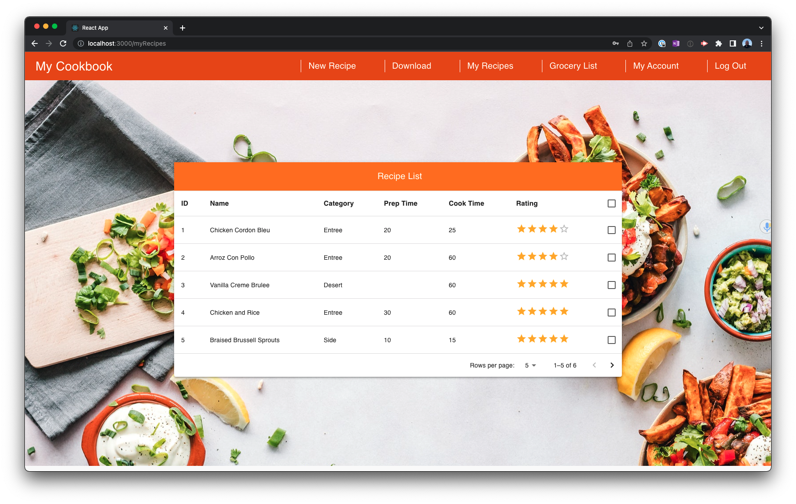
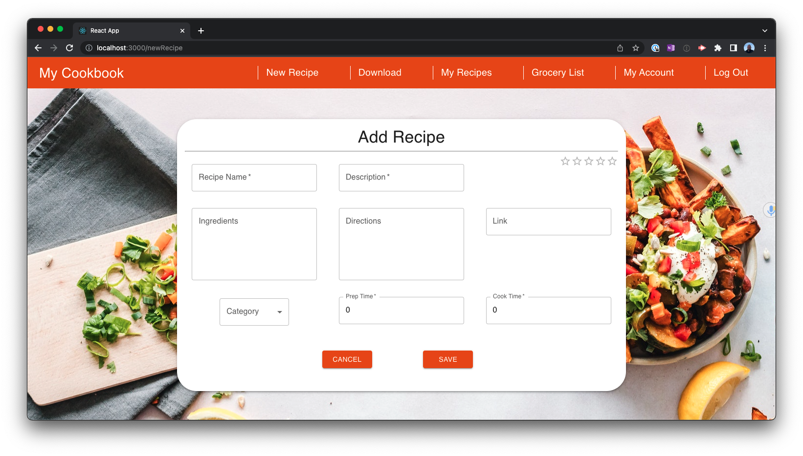
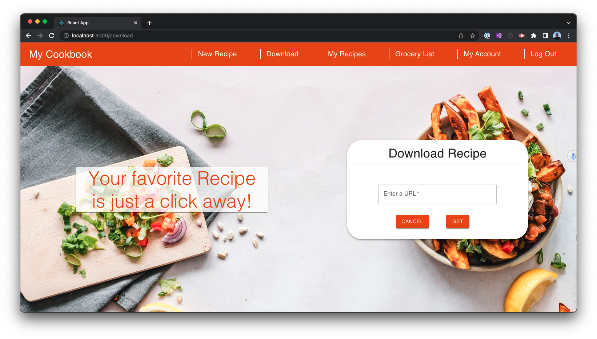
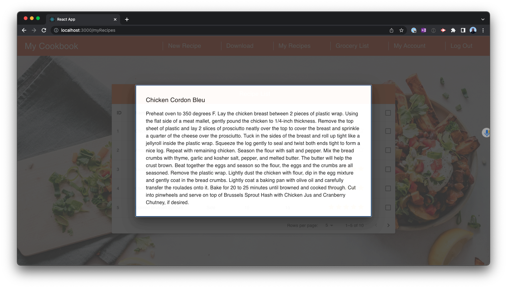
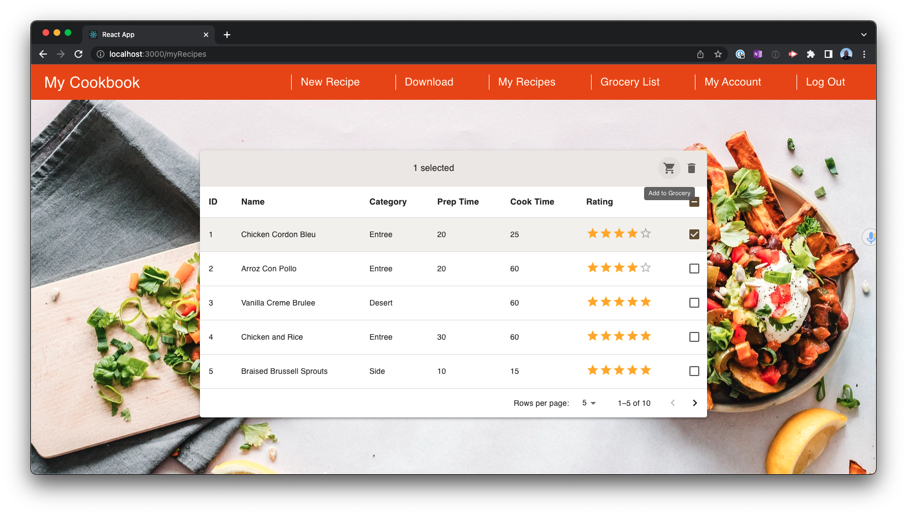
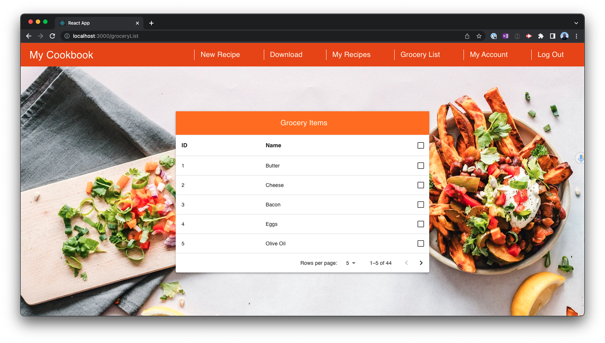
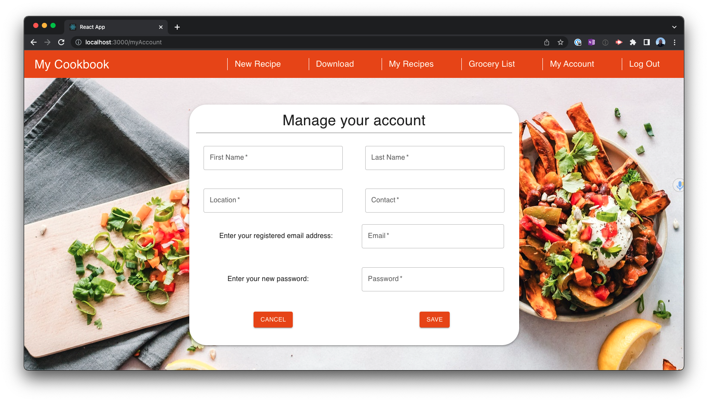
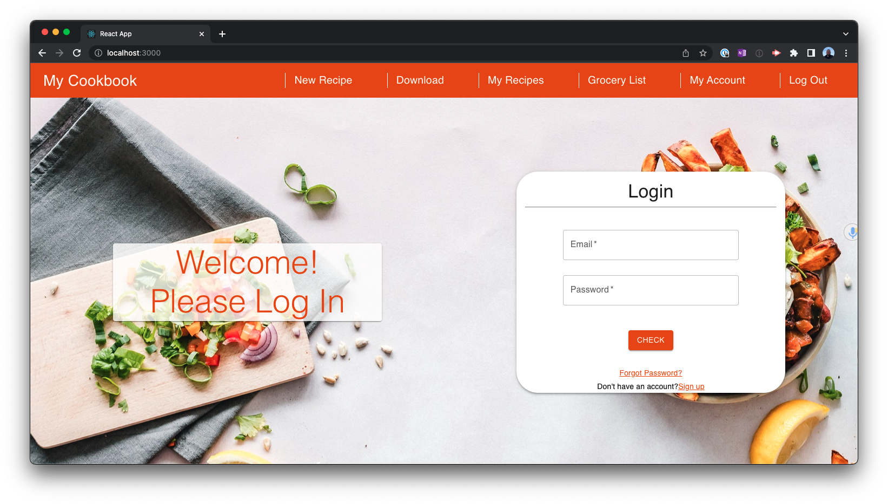

# My Cookbook

We are proposing an application to manage various recipes, in order to consolidate and organize them for quick and convenient access.​

If a user creates or has found a recipe they want to save, they could simply enter some of the basic information about the recipe, and the app will save it to a database. Or if the user would like to import a recipe from a website, they can enter the URL and it will be added in the proper format.​

All saved recipes would be available to query and reference at any time. The app will also give recipe suggestions based on what ingredients are on hand.​

## About

The goals of this project are:​

- To learn and understand the development of an application that utilizes a GUI front end and data processing back end.
- To apply the principles of software engineering to accomplish the development of said application.

* * *

## Features

- Manually add a recipe to the database via UI form:


- Add a recipe via downloading from a URL. The URL is limited to a foodnetwork URL for now, the goal was to add several recipe sources to this.


- View a recipes directions by clicking on the name:


- Add the ingredients of a recipe to the `grocery list`


- Management of a `grocery list` which can add or delete items from it


- Account management


- Login to your account


* * *
## Technologies Used

- Node.js
  - React
    - Express
    - Axios
    - knex
  - SQLite
  - Python
  - Git/Github

## Configuration

After downloading the application, navigate to working directory and:

```shell
npm start # launch the application
npm test # run tests
```

## Licensing & thanks

This project is released under the [MIT License](./LICENSE.txt).

## Changelog

- v1.0.0
